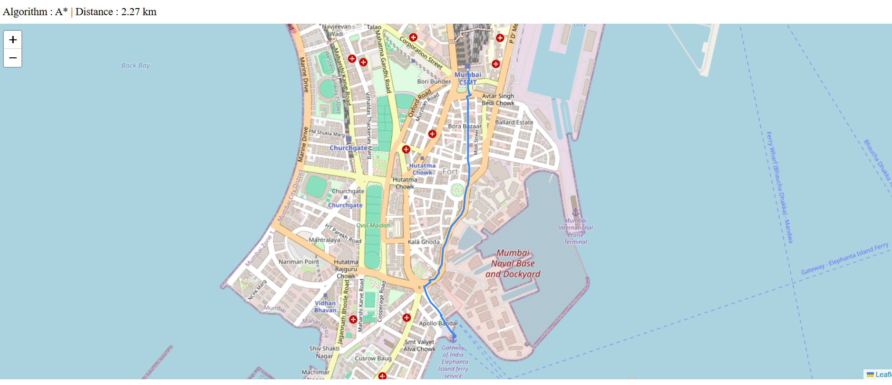

# City Route Planner

A C++ application that finds the shortest path between two locations on a real city route network using OpenStreetMap (OSM) data. The project builds a weighted graph from OSM data, compares Dijkstra's Algorithm and A* Search, benchmarks their performance, and visualizes the computed route on an interactive map.

## Demo

### Route Visualization



---

## Features

- Parses OpenStreetMap (.osm) city route planner data
- Builds a weighted graph using adjacency lists
- Computes shortest paths using Dijkstra's Algorithm and A* Search
- Benchmarks execution time and number of nodes explored
- Exports the computed route as JSON
- Visualizes the shortest path on an interactive map using Leaflet

---

## Project Structure

```text
city_route_planner/
│
├── data/
│   └── city.osm
│
├── images/
│   └── demo.png
│
├── output/
│   └── path_output.json
│
├── src/
│   ├── Graph.h
│   ├── Parser.h
│   ├── Algorithms.h
│   ├── Benchmark.h
│   └── main.cpp
│
├── map.html
└── README.md
```

---

## How It Works

1. Parse the OpenStreetMap (.osm) file.
2. Build a weighted graph where intersections are nodes and roads are weighted edges.
3. Convert the input GPS coordinates to the nearest graph nodes.
4. Run Dijkstra's Algorithm and A* Search.
5. Compare runtime and nodes explored.
6. Export the computed path as a JSON file.
7. Display the route on an interactive map.

---

## Technologies Used

- C++
- STL
- OpenStreetMap (OSM)
- Leaflet.js

---

## Building and Running

Compile the project from the project root.

```bash
g++ -std=c++17 src/main.cpp -Isrc -o planner
```

Run the application.

```bash
./planner
```

---

## Viewing the Route

Start a local web server.

```bash
python3 -m http.server 8000
```

Open your browser and visit:

```
http://localhost:8000/map.html
```

---

## Sample Output

```text
City Route Planner

Nodes : 92745
Edges : 23271

Running algorithms...

Dijkstra: 2.27 km | 4041 nodes | 44175 us
A*:       2.27 km | 449 nodes | 24968 us

A* speedup: 9.00x fewer nodes visited
```

---

## Future Improvements

- Faster nearest-node search using spatial indexing (KD-Tree / R-Tree)
- Support for larger city maps
- Turn-by-turn directions
- Interactive GUI for entering source and destination coordinates
